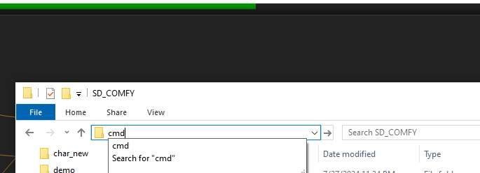
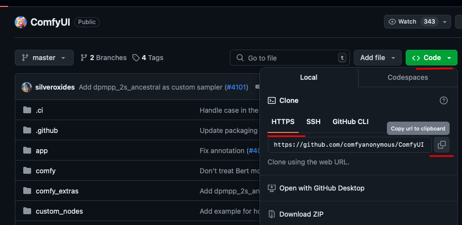
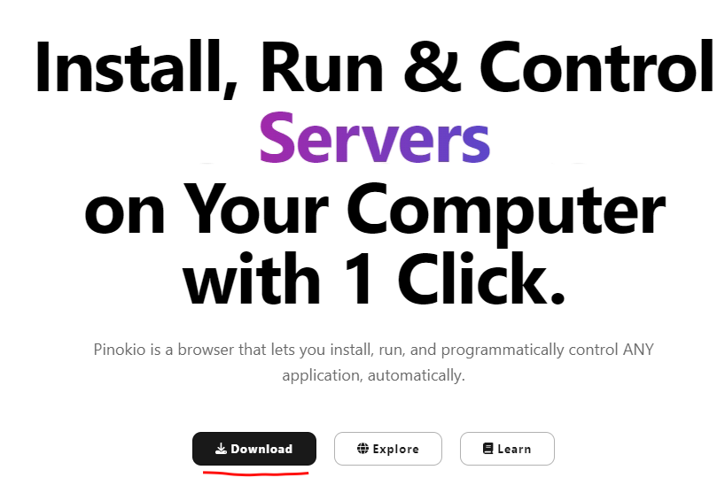
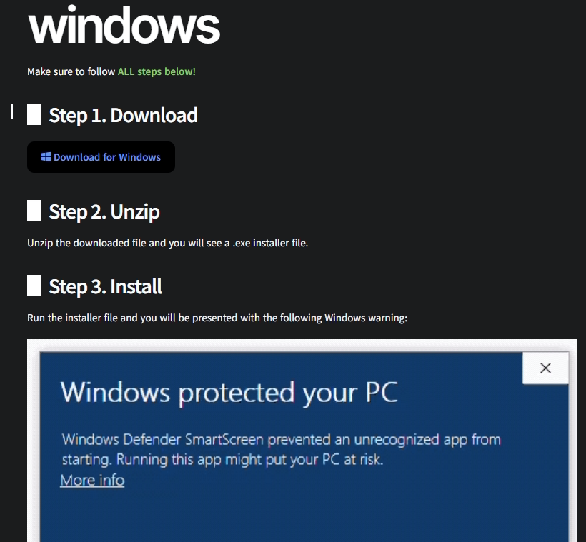
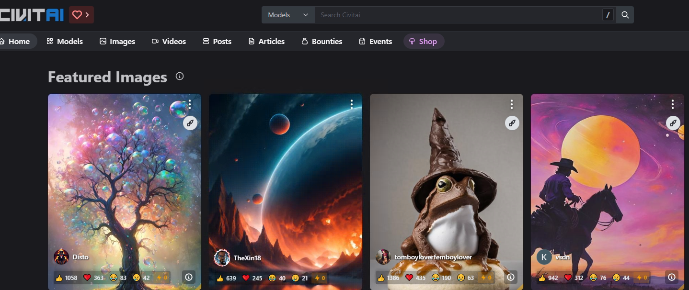
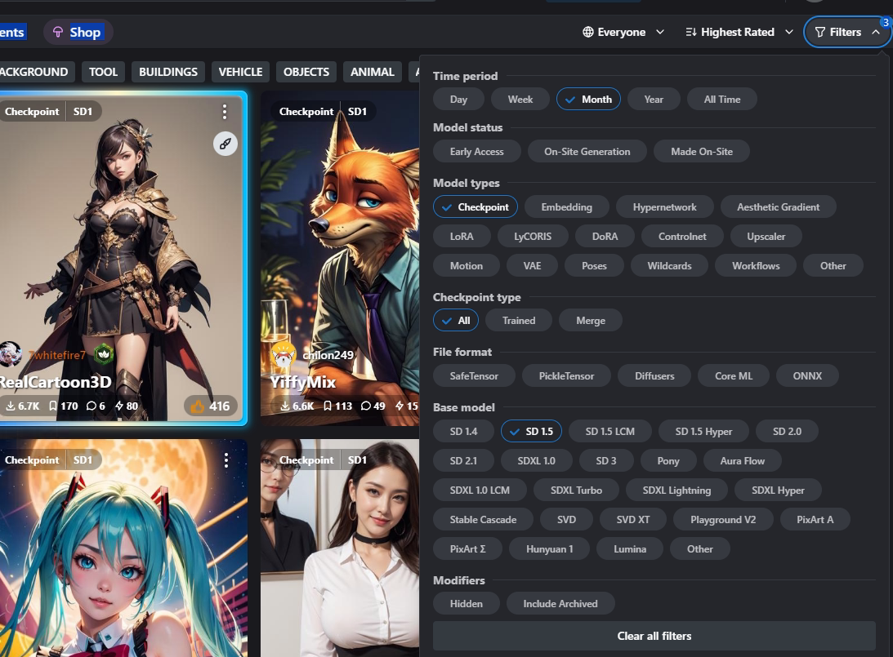

# Lesson 1: Diffusion Models, Stable Diffusion, ComfyUI

AI systems capable of generating images have been around for a while already, but only in 2020, a barely known back then class of machine learning models has emerged. What we're talking about are the Diffusion Models that allowed generating images of a much higher quality than any other existing type of models before. DALL-E 2 being the first to hit the mainstream due to its easy usage and meme potential; has shown to the large audience that it is quite possible for anyone to just type in some text of what they'd like to see and retrieve a nice synthetic image. DALL-E is far from being the focus of this project, as it has three significant drawbacks: 

* it's proprietary software with a limited free functionality
* poor control over the generation process, the user is limited to only guiding the AI with a text prompt
* it only runs on the server of a service provider (e.g. Microsoft Bing)

That's why here we'll be talking about Stable Diffusion - an open-source diffusion model with a huge community that is free to use, can be deployed locally if you have a decent PC, and offers an infinity of ways to control the generation, allowing you to really get what you want from the AI.

It has been released for the first time largely released back in 2022 and a lot of stuff has happened to this model during 2 years of its current lifetime. Countless versions, flavors, user interfaces... When it all started, all you had available is one single Stable Diffusion (later SD) model and a set of Python commands to run its capabilities. There is a ton of information on the Web on how to install and operate a specific user interface for SD, but this set of tutorials will be focused on ComfyUI - currently the most popular and capable UI for SD. 

Currently there are two user intrfaces preferred by the majority of SD users:

1. **Stable Diffusion WebUI, also called Automatic 1111 (commonly referred to as simply a1111)** - a reatively simple web interface that was the first breakthrough in terms of SD usability
2. **ComfyUI** - a node-based web interface that revolves around portability and multitasking. Unlike a1111, ComfyUI allows much more stuff to be present on the screen at the same time, being much more versatile, but at the same time, appears to be much messier than a1111

&nbsp;

## To see the differences between these two interfaces, check the two screenshots below:

{width=75%}  
*here's how Automatic 1111 UI looks*

{width=75%}  
*and here's ComfyUI*

While for a newbie both UIs might seem quite intimidating and overwhelming, trust me: a1111 is inherently much more straightforward and has a relatively mild learning curve if compared with ComfyUI. Thing is, ComfyUI makes you assemble each workflow from scratch and there is absolutely nothing that could ever limit you. On the other hand, a1111 always presents you a set of default functionalities that will be useful in almost any scenario you'll ever deal with. Although generally good for newcomers, a1111 has huge drawbacks in terms of optimisation. The same functionality will work much faster in ComfyUI. Also, a1111 has no possible ability to have multiple workflows running on a single server instance (well, you could open several browser tabs, but that's gonna suck).

That being said, the focus of these guides will be ComfyUI. My personal goal is to teach a complete n00b how to do AI art the right way.

As it was mentioned earlier, one of the biggest advantages of SD is the fact that you can run it locally, given you have a decent rig. My personal recommendation for being comfortable with most things SD can offer is a stationary gaming PC with an Nvidia GPU at least as good as **RTX 3060 12GB _(VRAM in SD does a lot of heavy lifting, hence 3060 sometimes can beat more powerful, but narrower in terms of memory GPUs such as 3070 or 3070TI)_**

***

## Installing ComfyUI on your local PC 

Although the easiest way to guide you through the installation of ComfyUI would be to simply force you access their <ins>[Official Repo](https://github.com/comfyanonymous/ComfyUI)</ins> to get the freshest installation steps, this guide's book-like format makes me want to offer a more exhaustive, albeit Windows-only walkthrough.  
Nevertheless, currently (as of July 2024), there are 3 ways one could have ComfyUI up and running on their machine:  

1. **Portable version**
2. **Full local installation with manual dependency management**
3. **Full local installation using Pinokio**

Let's see what are the pros and cons of using each method:

1. Portable ComfyUI

	| Pros  | Cons  |
	|:-:|:-:|
	|  \* Most used | \* Sometimes causes issues with conflicting custom nodes  |
	| \* Very easy to follow  | \* Any dependency issue requires you to dig into Python venv  |
	| \* Agnostic of your main Python version  |  \* Useful Python deps installed outside this ComfyUI distro won't be detected and vice versa | 
	| \* Doesn't require additional software  |   | 
	&nbsp;

2. Full local install

	|  Pro |  Cons |
	|:-:|:-:|
	|  \* Full control over what is installed on your pc | \* Might be extremely overwhelming for newcomers  |
	| \* The way to go on non-Windows platforms  | \* manual and tedious installation process  |
	|   |  \* requires you to work with GIT  | 
	&nbsp;

3. Using Pinokio AI browser

	|  Pro |  Cons |
	|:-:|:-:|
	|  \* According to the reviews, get everything in one click | \* Relatively new, hence less known and trustworthy   |
	| \* Get access to lots of AI tools besides Stable Diffusion  | \* Still a 3rd party software necessary  |
	|  \* Doesn't cause conflicting custo nodes |   | 
	&nbsp;

You decide what method suits you best, but we'll take a look on how to install ComfyUI using each one.

## Portable ComfyUI

1. Access the [Official Repo](https://github.com/comfyanonymous/ComfyUI)
2. Scroll down to "Installing" section or access [This Link](https://github.com/comfyanonymous/ComfyUI?tab=readme-ov-file#installing)
3. Download the archived version by clicking "Direct link to download" (it will take quite some time)
4. I recommend that you look for a nice place on your SSD that has a lot of free disk space, you'll definitely need a lot 
5. Create a directory that will have an easy to remember name, like, for example **D\:\\SD_COMFY** 
6. When the download has finished, move the archive inside the newly created directory
7. Hopefully you have 7Zip installed (if not, then [go and get it](https://7-zip.org/)); right click the archive -> 7Zip -> Extract here
8. You're done! 

## Manual Installation

1. First, make sure you have at least Python 3.12 installed (you can get it [here](https://www.python.org/downloads/release/python-3120/))
2. Just because there are tons of Python versions out there, each potentially being able to conflict with another, refer to [this guide](https://docs.python-guide.org/starting/installation/#installation) to increase your chances of successfully running Python 3.12 on your Windows machine
3. Install GIT on your machine (get it [here](https://git-scm.com))
4. After installing GIT, you gotta clone the official ComfyUI repo. That means that you'll have to access your desired ocation, for example something like a folder called **D\:\\SD_COMFY** and do the following steps:
	* click the address bar
	* type in "CMD"
	* hit enter  
	
	* now go back to the browser where the repository is open and copy its HTTP address to clipboard like it's shown on the screenshot  
	
	* in your CMD window type in **git clone https://github.com/comfyanonymous/ComfyUI.git**
	* for Nvidia cards you must have Torch installed: type in your CMD this command **pip install torch torchvision torchaudio --extra-index-url https://download.pytorch.org/whl/cu121**
	* after Torch is installed, open a terminal inside ComfyUI folder just like you open it not so long ago (type in CMD in address bar) and write down this command: **pip install -r requirements.txt**
	* You're done!

## Pinokio installation

1. access Pinokio's [official website](https://pinokio.computer/) and click the "Dowload" button  

2. basically follow the instructions presented on the page and you'll have Pinokio up and running!  

***
&nbsp;

Alright! We've got ComfyUI installed, but can we run Stable Diffusion already? Well, not quite yet. See, ComfyUI doesn't ship with SD. You'll have to find your favorite model on the web. Luckily, there are more than enough various SD models out there and these they're all stored on a dedicated website called [CivitAI](https://civitai.com/)

  

This is the place where you'll be downloading the majority of models necessary for delivering SD's fullest potential with the help of ComfyUI. 

A barebones SD workflow requires at least one SD checkpoint and a VAE. While I'll be saying a couple of words about these in the next lesson, I recommend you just select the "Models" section on the website and start explore the filters. Please keep in mind that this webside is under perpetual construction and its layout has already changed drastically multiple times. That's why it's always important to stay tuned. 

That would be the end of this lesson. At this point you just have to figure out what's your choice on a ComfyUI distrubution. In the next lesson, I'll tell you a couple of words about how Stable Diffusion works and how to run it in ComfyUI.
