# Lesson 2: How Diffusion Models work; Your first dive into ComfyUI

Alright, just because I'm far far from being a connoisseur in Machine Learning, well try to intuitively understand what's up with Diffusion Models. First of all, Diffusion Models literally allow you to create images out of "nothingness", or, more precisely, random noise (see screenshot below)  

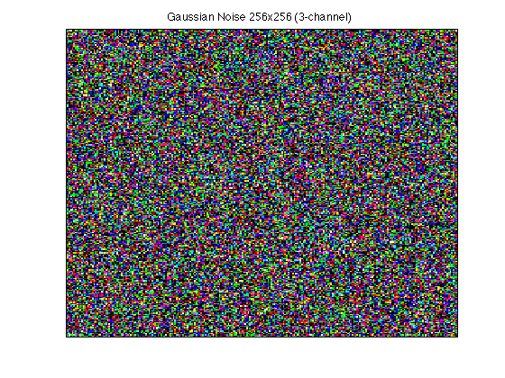

Suddenly something happens and this noise turns into this image:

&nbsp;

Now what the hell is happening here? How did the AI commit this witchcraft? Well, unfortunately, there is no magic involved in this process. Matter of fact, if we let intricate mathematical formulas apart, the concept is quite simple. Thing is, the image itself doesn't appear utterly out of _nothing_. This noise once was an image. Not necessarily an image of a pretty girl; that could be a picture of a man or a car, doesn't really matter. What matters is that, during the training process of a Stable Diffusion model, a veeeeery large dataset of image was fed to it, with each image being preprocessed in a specific way; then, the dataset was in turn gradually turned into a sort of digital noise, and here's where the name **Diffusion** comes in! Diffusion models are sort of based on the physical process of diffusion that happens in nature:  

>Imagine a drop of ink that has fallen into a glass with clear water. When the ink makes contact with water, it immediately **_diffuses_** into it, so that soon you can't even tell that something else but water exists inside the glass.

***

Something similar happens during the training of a SD model. A real image from a large dataset is gradually messed up with noise until it completely disappears. The image itself **_diffuses_** into Gaussian noise.  

>Alrighty, the analogy is understood. But why innocent images are killed during the training process? 

Bright minds behing Stable Diffusion have figured out that if you feed a model tons and tons of images, let it turn the images into noise as a result of a set of iterations, you can force the model generate synthetic images from complete noise! And you're going to also do that in an iterative manner, gradually **removing noise** from an initial noisy image. This is done by a special element withing a Diffusion Model called "Noise Predictor". This predictor is specially trained to detect how much noise should be removed during current step, so that as a result of, for example, 30 steps, we'll have an image of a cat as output. A schematic representation of this iterative process can be found in the image below:   

&nbsp;

&nbsp;

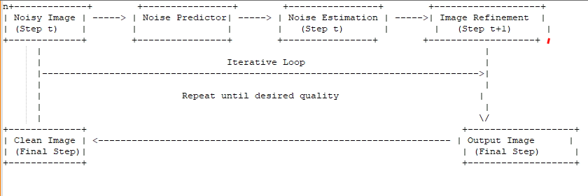

We can summarize the previous paragraph into two major processes:

1. **Forward Diffusion** - involves turning a real-world image into complete nonsense by iteratively adding noise to it
2. **Reverse Diffusion** - allows gradually removing noise (this process is also called **_Denoising_**) from an initial nonsense to get an adequate synthetic image in the end

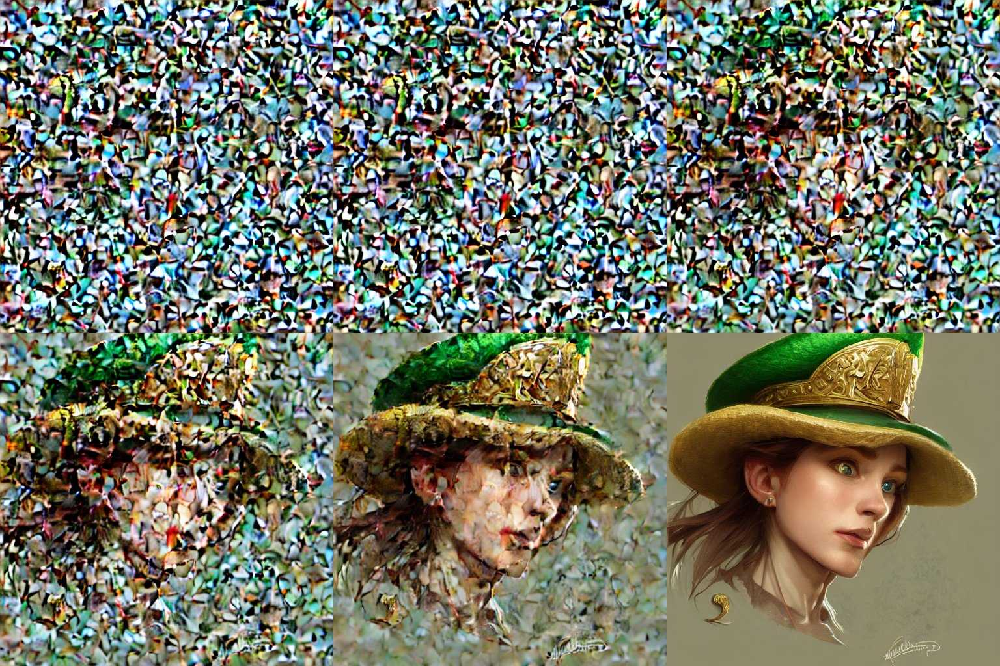

The above image nicely demonstrates how **denoising** works in Stable Diffusion. Under the hood, it is just a parameter whose strength you can specify so that there is more or less noise removed during each step. Inside ComfyUI you won't find such terms as _"Noise Predictor"_. Instead, we'll be focusing around **Samplers** and all the parameters associated with them. 

I must confess, however, that the diffusion we've talked about so far is not exactly the type present in Stable Diffusion. In its simplest form, diffusion is considered _**unguided**_. That means that, well, we launch the model to do its thing, and the end result will be a completely random image based on something that existed in the training dataset. It means that, if a SD model was trained only based on images of cats and dogs, when using _unguided_ diffusion, the generated image will represent either a cat **OR** a dog.  

> Not very useful, right?

To really make the model do what we want, we must _**guide**_ it. The simplest form of guidance, as you might already know, is a text prompt. Before the generation starts, a special unit within Stable Diffusion, called a **text encoder**, translates human text into something called _**embeddings**_. These embeddings, or in other words _**tokens**_, are nothing but sequences of numbers. Numbers is the only language that a machine understands, because under the hood it's always 1 or 0. That's why, when proviging a text prompt to a SD model, we exercit a form of **Guided Diffusion**. As you'll find later in this material, SD is marvellous for a big amount of instruments that allow you control the generation process even better than with a mere prompt, in ComfyUI specifically you'll meet countless times such keywords as _**conditioning**_ (we'll talk about it more when we study ControlNets). 

I apologize for so much theory, but I consider it crucial when taking Stable Diffusion seriously. Exactly the _Engineering_ aspect of AI craftsmanship is what differentiates a good AI artist from an average kitsch Midjourney fan. I believe you can barely hold your desire to gain some hands-on experience with creating your own AI art, eh?

>To do that, of course, we'll have to perform our first launch of ComfyUI! 

***

&nbsp;

&nbsp;

As it was mentioned in the previous lesson, there will be lots of download operations happing during these guides, so your first task will be:

1. Navigate to [CivitAI](https://civitai.com), find the "Models" section and set the filters to **type: checkpoint** and **base model: SD 1.5**. Don't worry if you don't understand the meaning of these filters, I'll explain them pretty soon.
2. Once you find a model that looks appealing to you and corresponds to the selected filters, navigate to the model page by clicking its thumbnail
3. Aaaaand download it by pressing the corresponding button (see screenshot)  
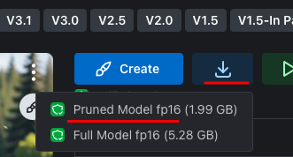
4. Once the model has been downloaded, move it from your downloads folder to the location inside your ComfyUI directory that looks like this:  
	* "X:\\path\\to\\your\\SD_COMFY\\**ComfyUI\\models\\checkpoints**"
	* you'll even find a hint file suggesting you where to place your checkpoint, so that you never mess this up
	* 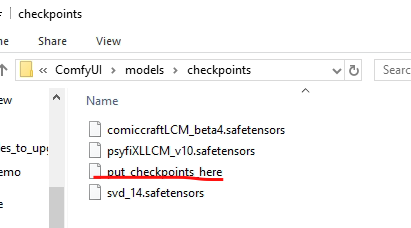
5. Next, access this [link to a VAE](https://civitai.com/models/276082/vae-ft-mse-840000-ema-pruned-or-840000-or-840k-sd15-vae) suitable for your SD checkpoint and download it just like a step abode
6. After the download has finished, move your VAE to a location that looks like this:
	* "X:path\\to\\your\\SD_COMFY\\**ComfyUI\\models\\vae**"
	* 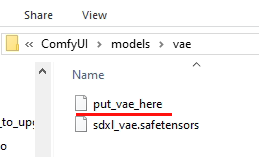

***

On one hand, the steps performed above were pretty straightforward. On the other hand, something is definitely out of context... After a small analysis, we can derive several questions:

* wtf is _**SD 1.5**_?!
* wtf is a _**base model**_?!
* wtf is a _**checkpoint**_?!
* wtf is a _**VAE**_?!

Let's answer them one by one:

> ## **wtf is SD 1.5?!** - Stable Diffusion exists in a variety of versions  
Over the years, Stability AI, one of the tenants responsible for the development of Stable Diffusion, has released to the public a wide range of SD models that differ in output quality, operation mode, base resolution, etc. Check this screen to figure out how many of them have been pushed out during 2 years of SD's lifespan:  

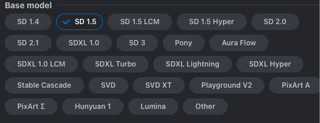

Just because it will take a little too much space to describe each and every model, especially because we'll be using only 2 types for the majority of time, I'll offer you a broad description by model class:

1. **SD 1.X models**  
	* This is the class of models that was first released to the public. SD 1.4 was first to clearly show limitless capabilities of Stable Diffusion family of models, it became really viral because people were able to take the original SD 1.4 and fine-tune it for better results. Currently SD 1.5 serves as a foundation for almost any 1.X version out there. One huge drawback of 1.X family of models is the fact that they were trained on datasets consisting of relatively low resolution images, that is, 512x512. Nowadays it's quite a small size even for a mobile phone, right? Well yeah, however the training process of the first release of Stable Diffusion had a duration of 1 entire month and its cost was a 6-figure number... Imagine how many 512x512 images were fed to the model?..
	* This family of models can be easily used for commercial purposes (meaning that you can sell your stuff without a need to contact Stability AI for permission)
	* Due to a lack of censorship, these models are highly versatily and are able to do both SFW and NSFW stuff

2. **SD 2.X models**
	* After the huge success of SD 1.5, Stability AI thought that they could solidify their success if they were to supply the model with image datasets of a higher resolution. Well, that sounds right, so They indeed have supplied a set of 768x768 images to the training process. Was the model better than SD 1.5? Hell nah... Moreover, it turned out to be much-much worse... But why?! well, because see next bullet point
	* The model turned out to be highly censored, which means that it inherently knows much less about human anatomy. That resulted into Lovecraftian horrors beyond human understanding when one wanted to simply generate a human being
	* Also, a bit over the current context, SD 2.1 had a different _text encoder_ (i.e. a software block responsible for translating human prompts into numbers that are understood by the machine) that is incompatible with any existing SD 1.5 extension. That makes SD 2.X pretty much useless (although it still probably has its own fanbase)

3. **SDXL**
	* A relatively recent set of models that feels like a hybrid between SD 1.X and SD 2.X. Thing is, it had a _slightly_ different encoding system, meaning that prompts that were working on SD 1.5 weren't necessarily working as well on SDXL; at the same time, 1024x1024 images were involved durning training, which improved drastically the quality of generated images.
	* Is free to use for research purposes. For commercial intentions, it is advised to contact Stability AI
	* Feels more strict in terms of censorship out of the box. Nevertheless, the community was able to enrich SDXL with plenty of NSFW content (it made the model only better, trust me)

4. **SD 3**
	* A long-awaited release of a revolutionary model that had to be the one to prove that open-source rocks. Unfortunatily, that wasn't the case... Due to severe financial troubles back at Stability AI, the model was released in a very crude state, they called it "medium". The quality was far from what was advertised, wasn't long before everyone hatefully rejected it. As of late July 2024, SD 3 is considered mostly a failure (I've started to notice a Windows-like pattern in releases: good, bad, good, bad, just like Windows XP, Vista, 7, 8, you get the idea)
	* Due to poor training methodologies, the model is inherently heavily and deliberately consored. When you try to generate "a woman _lying_ on the grass", the model for some reason things that the word "_lying_" symbolizes a naked body, resulting into absence of a huge chunk of anatomy information during the generation process; as a result - monsters and mutants, just like with SD 2.X
	* Allegedly SD3 has a much better understanding of input prompt. At least what it can do well is generate text from human prompt
	* In terms of style it has a very strong bias towards 2 quite bland and generic-looking styles: realistic illustration and simple illustration

5. **SVD - Stable Video Diffusion**
	* A model that was released with the intention of generating video from text or video from image
	* A typical result is only a couple of seconds long
	* You're unable to guide the generation using a text prompt. Everything is let at model's discretion
	* Basically serves as a toy without too much usability

6. **Miscellaneous SD models**
	* with an increase in resolution, the time necessary to generate an image has increased too, a lot... Since the vast majority of SD users can't afford top notch GPUs, lots of optimisation techniques were developed
	* LCM
	* Turbo
	* Hyper 
	* Lightning
	* Stable Cascade
	* these are all models that were tuned specifically such that it is possible to achieve a nice-looking result by involving only a couple of steps during the generation. That is, instead of waiting for 30 steps, only 2-15 were necessary, very much depending on the optimization flavor. Unfortunately, everything comes at a price in AI world too, hence the generation is fast, but the level of detail sucks! Same goes with prompt adherence too. The model simply doesn't take into account longer prompts.

***

> ## **wtf is a base model?!** - It was partially mentioned in the previous answer that the community efforts have allowed drastically improving the quality of Stable Diffusion models.  

In this case, a **base model** is just a type of SD model that was initially released as a clean, virgin version, that would later be used by the community for improvement purposes. As an example we have a type of SDXL-based models called _Pony Diffusion_ -- no doubt, they feel like something completely out of this world

***

> ## **wtf is a checkpoint?!** - I must reiterate again that ComfyUI is just a user interface itself, i.e.  

it is a set of buttons, pistons, sticks and stones that allow you as a human to easily communicate with the AI. A checkpoint is Stable Diffusion itself. It is the heart of the whole technomajick and it's exactly the core that was carefully, thoughtfully trained by experts on huge GPU-infused rigs.

***

> ## **wtf is a VAE?!** - here things start to get a bit theoretical again...  

you see, a **_Variational AutoEncoder (or VAE)_** is a neural network architecture that actually allows Stable Diffusion to work on your machine without having to wait for decades for a small 512x512 image to render. Once again, I'll try to explain this all intuitively.  
Thing is, if a neural network would be to generate a 512x512 grid of pixels, i.e. a small image by todays standards, pixel by pixel..... it would take ages, and I mean ages to succeed! Because, given that in digital terms a pixel can be either blue, green or red, and each pixel in a 512x512 grid can have one of these 3 colors, when creating such a picture, the AI has tu figure out the exact colors of the future image for 768432 variants... It's whole lot of compute to do, folks!  
Thankfully, smart guys have somehow figured out that, well, if, instead of generating 512x512 grids from scratch, you can actually reduce the amount of pixels to a much smaller grid of 96x96 and still maintain the vast majority of details, as well as the subject and context of the image, basically intact. This maneuver introduced the concept of _**latent space**_ that is, something almost astral situated between void and pixel-space, it is a virtual, sompressed surface, where your image is being injected iteratively, with all the information necessary to describe the final result, and iteratively this small-sized surface is being denoised, after which the result is upscaled, or rather, upsampled, so that a bigger resolution result is available to the end user.  
It's not at all necessary to know the underlying theory of VAEs, but I definitely gotta introduce you to them, as during your work with ComfyUI, you'll encode and decode images using a VAE in 100% of your workflows, so it's good to have a slight understanding WHY the hell you always have to do this. 

***

## Alright now, time for big accomplishments

>_For now we'll talk only about launching the portable version of ComfyUI_

* Open up the folder where you've extracted all your ComfyUI contents, something like "X:\\path\\to\\your\\SD_COMFY\\**ComfyUI\\models\\checkpoints**"  
* Assuming you're ona Windows machine, you'll have to launch the file called **run_nvidia_gpu.bat** for your sweet Nvidia GPU. Double click it. If you're unfortunate enough to lack a decent GPU, you can perform a CPU-only launch, so double click **run_cpu.bat** in this case. Disclaimer: in such a scenario, each image will take ages to be generated... F... (Stable Diffusion is all about trial and error)  
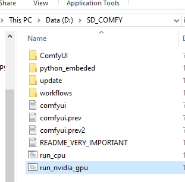  
_given it's your first launch of the system, ComfyUI will take its time to download all the additional packages_

Once all the downloads have finished, an Internet browser window will open in a new tab and you'll be greeted with this screen:

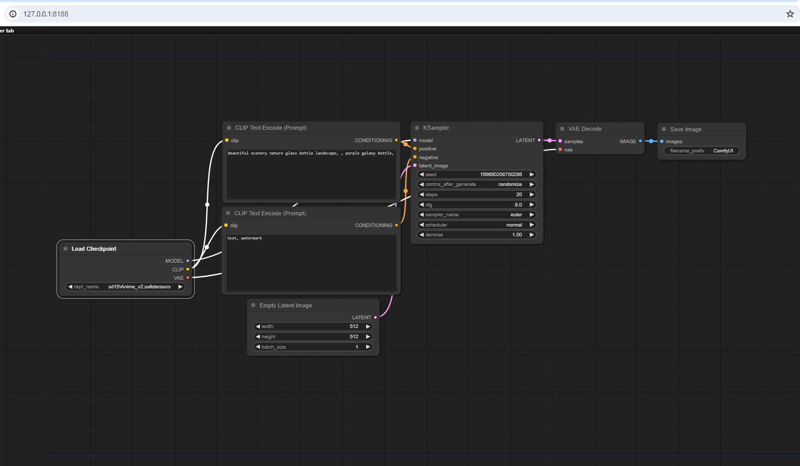  

To somebody such a layout might appear a bit confusing, for others (people experienced with software such as Blender, Touch Designer, etc.) - quite familiar. You see, some say that it is the future of software: modular, block-like structures with all the corresponding parameters visually represented per block. Each block can be interconnected with some other block. Such paradigms can be used in a variety of areas, starting with software development and ending with... well, AI art. 

First thing you have to do now is get comfortable with navigating the space. What's amazing about ComfyUI is that its workspace is virtually infinite. Also, notice the numbers displayed in your browser's address bar: **127.0.0.1:8188** - it is called _Localhost_ - a special web server running locally on your PC. It means that, while you're working with SD, ComfyUI doesn't access the Internet anyhow (unless you try to download something using the _Manager_, but we'll study it a bit later). It's good news, you can be sure for your privacy while working and none of your progress will be lost in case of a network failure. You can even start ComfyUI without Internet connection and it will work just fine.

***

>Now, please remember this set of moves that'll allow you to properly navigate ComfyUI:

* **click and drag through any area excluding the blocks to propel yourself through the workspace**
* **use mouse scroll up/down to zoom in and out of the workspace**
* **DON'T use ctrl+mouse scroll to zoom in and out, as it will mess up your layout**
* **click and drag a block to move it around the workspace**
* **to select a block, left click it with your mouse (a white frame will appear around it)**
* **to deselect a block, click on the background outside this block or click on another block (you'll select it instead)**
* **to select multiple blocks, keep the CTRL button pressed while left-clicking with your mouse on each block you'd like to add to the selection**
* **to move around multiple blocks at the same time, first select them all using ctrl+left-click, then, while keeping the Shift button pressed, left-click on one of your selected blocks and move it - you should move now the whole selection**  

>After you got yourself comfortable with moving things around, let's dig deeper into how blocks are organized and interconnected, but before that please find the pannel situated in the lower right corner of your screen and click on the "Queue Prompts" button on it:

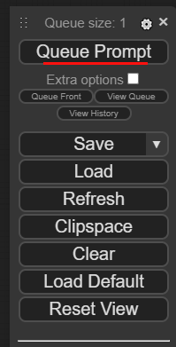

_After a considerable time has passed... (all the data is being loaded up into memory, you'll see a green progress bar appearing on a block called KSampler, and then.... Voila!_

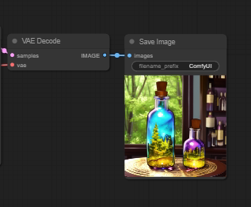

Congratulations, you're now oficially become an AI artist! (_well, not really, the result is a generic low quality image. Only practice and experimentation will turn you into an AI artist :^)_)

### Alrighty, let's try to understand what happens around these blocks. Moreover, let's start calling thes blocks **NODES**, it sounds a bit more professional

1. Try to comprehend a ComfyUI workflow as a flow of information from node to node, through a set of connections  
A good analogy would serve imagining water flowing from left to right through a set of pipes. That's how these connections are usually called.
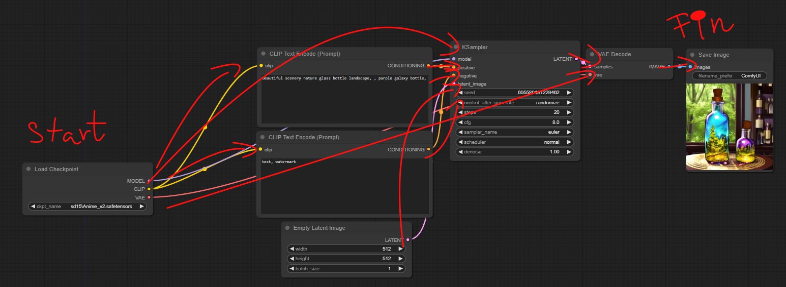
2. Each node, besides having its corresponding parameters that you can adjust, also usually 1+ inputs and 1+ outputs _(some nodes might lack inputs or outputs)_
3. Inputs and outputs use a color matching scheme so that you won't ever confuse them (you still can by accident and I'll show you when it's time)
4. Every workflow must start with loading primary, indispensable models, that is - a SD checkpoint and a VAE
_Note: some checkpoints you'll find on the Internet can already contain a VAE inside, usually they're noted as baked-in VAE or something like this. Nevertheless, it's always a good practice to load a VAE separately)
5. The majority of node parameters are either text boxes or selector lists.
In case of our first node "Load Checkpoint", it has only one selector that contains the name of your current checkpoint. If, for example, you have more than one checkpoint, you can click on this parameter and a selector will apear, showing what you can choose from. Otherwise you're free to click the arrow buttons to the left and right of your parameter, they will switch the checkpoint. In case of number values, clicking arrows will increment/decrement the value. Also, click and drag applied to a numeric value will allow a fast increment/decrement by arbitrary amounts
6. In order to create a connecting pipe from one node to another, click on one of the colored dots situated on the right of the node (that is, the output of the node) and drag it somewhere.  
Now you have two options: either find a node that has an input of corresponding color _(you'll see that the necessary input, if present, will be highlighted by ComfyUI)_, or, if you changed your mind, just drop the connection anywhere you want _(this will pop up a large context menu that has will offer you a set of followup actions)_
	* manually select a desired node from a giant list of all possible nodes
	* search for the desired node using a handy search bar
	* a sublist of possible nodes compatible with the pipe that you're creating right now  
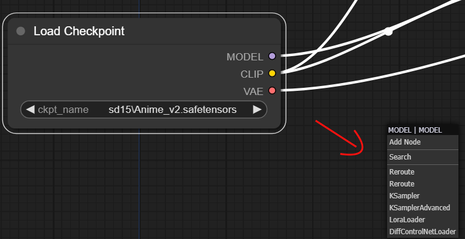
7. If you want to change the destination of a pipe, drag it from the input of the node and you'll notice how it has disconnected. Now you're free to find a new destination input for this pipe
8. In case you want to remove a pipe from the input slot of a node, you can either
	* drag the pipe from the input of the undesired node
	* release it into the background afterwards
	* you'll notice that the context menu appears, but you don't need it, so just left-click away 
	* the undesired pipe has disappeared
9. You can also establish a connection by dragging a pipe from the input slot of a node and connect it to the output of a preceeding node
10. To instantly access the **Search Bar**, double click somewhere on the background (you'll be using this a lot)

> **Remember!** An _Output_ of a node can be connected to multiple different inputs of other nodes, while an _Input_ of a node can host only one pipe

*** 

Okay, let's perform an exercise now:

1. Open the search bar
2. Find a node called "Load VAE"
3. Place it on the workspace under the "Load Checkpoint" node
4. Replace the red "VAE" pipe that connects "Load Checkpoint" and "VAE Decode" nodes with a new connection between "Load VAE" and "VAE Decode"
5. Launch the workflow again by clicking "Queue Prompt"
6. Analyze the result. Anything changed? (It definitely did)
_The resulting workflow should look like this:_  
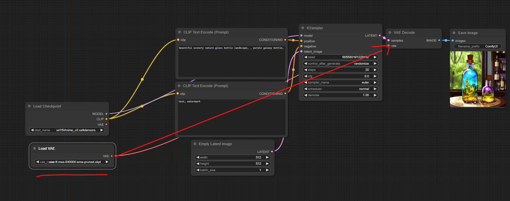

If you were able to flawlessly execute this exercise, it means that you're more or less confident with ComfyUI's operating principles.

***

>## Now, it's time to analyze each default workflow node a little bit more in depth!
